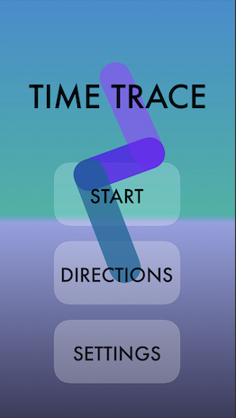
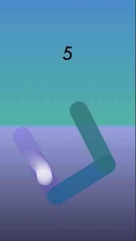
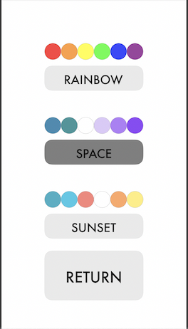
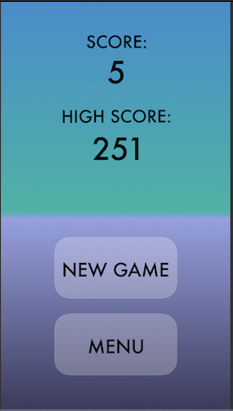

# Time-Trace

## How does the game work?

The player's goal is to beat their current highscore by tracing as many pathways as possible without veering off of the path, lifting their finger, or having the current pathway fade out before they reach the next consecutive line. A point is awarded when the user successfully traces a line. Within our game, there are three different themes for the user to choose from: Rainbow, Space, and Sunset. Each of these themes comes with a unique color palette and a custom background. 

| Home Screen | Game Screen | Settings Screen | GameOver Screen |
| ---- | ---- | ---- |
| |  |  | 

## Contributors:

* Ashley Granitto
* Connor Anderson

## Tools Used:

* Xcode
* Figma
